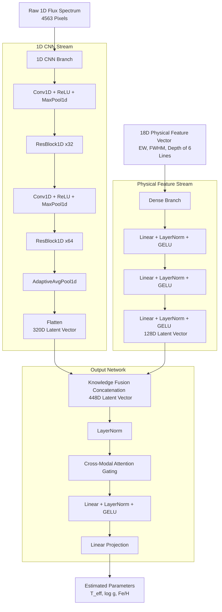

# StellarParameterHybridNet

### Fusing 1D Convolutional Networks with Parametric Physical Line Profiles for Stellar Parameter Estimation

A PyTorch-based machine learning pipeline designed to estimate fundamental stellar parameters—**Effective Temperature ($T_{\text{eff}}$)**, **Surface Gravity ($\log g$)**, and **Metallicity ($[\text{Fe}/\text{H}]$)**—directly from stellar spectra. The core architecture, `StellarParameterHybridNet`, implements a dual-stream knowledge fusion paradigm: combining a deep **1D CNN branch** for raw spectral flux feature extraction and a **Dense branch** that models 18-dimensional parametric physical line profiles (Equivalent Width, FWHM, and depth of 6 key absorption lines).

The pipeline is trained on the **SDSS DR17 MaStar (MaNGA Stellar Library)** and validated using real-world **SDSS DR17 / APOGEE** spectrograph data. It incorporates an explainable AI (XAI) framework based on cumulative Jacobian gradients to verify physical alignment against established stellar physics.

---

## Repository Overview

The repository is structured into modular components:

* 📂 **[src/](file:///Users/devmeko/Documents/KSA/3rdSem/GenAstro/TermProject/TermProject/src/)**: Core library package.
  * **[data/](file:///Users/devmeko/Documents/KSA/3rdSem/GenAstro/TermProject/TermProject/src/data/)**: Modules for data preprocessing and PyTorch datasets.
    * [preprocess_flux.py](file:///Users/devmeko/Documents/KSA/3rdSem/GenAstro/TermProject/TermProject/src/data/preprocess_flux.py): Reads raw spectra, applies pixel masking, and computes continuum normalization via a 201-pixel median filter.
    * [extract_features.py](file:///Users/devmeko/Documents/KSA/3rdSem/GenAstro/TermProject/TermProject/src/data/extract_features.py): Fits Gaussian profiles to 6 critical absorption lines to generate 18D physical feature vectors.
    * [extract_labels.py](file:///Users/devmeko/Documents/KSA/3rdSem/GenAstro/TermProject/TermProject/src/data/extract_labels.py): Extracts catalog target values ($T_{\text{eff}}$, $\log g$, $[\text{Fe}/\text{H}]$) and aligns them to the spectrum sequence.
    * [dataset.py](file:///Users/devmeko/Documents/KSA/3rdSem/GenAstro/TermProject/TermProject/src/data/dataset.py): PyTorch `Dataset` with sample filtering, z-score normalization, and data loading wrappers.
  * **[models/](file:///Users/devmeko/Documents/KSA/3rdSem/GenAstro/TermProject/TermProject/src/models/)**: Modular PyTorch model components.
    * [hybrid_net.py](file:///Users/devmeko/Documents/KSA/3rdSem/GenAstro/TermProject/TermProject/src/models/hybrid_net.py): Main [StellarParameterHybridNet](file:///Users/devmeko/Documents/KSA/3rdSem/GenAstro/TermProject/TermProject/src/models/hybrid_net.py) network model.
    * [cnn_branch.py](file:///Users/devmeko/Documents/KSA/3rdSem/GenAstro/TermProject/TermProject/src/models/cnn_branch.py): 1D CNN with Residual blocks (`ResBlock1D`) and Adaptive Average Pooling for raw flux analysis.
    * [dense_branch.py](file:///Users/devmeko/Documents/KSA/3rdSem/GenAstro/TermProject/TermProject/src/models/dense_branch.py): MLP layers that embed the 18D physical feature vector.
    * [fusion.py](file:///Users/devmeko/Documents/KSA/3rdSem/GenAstro/TermProject/TermProject/src/models/fusion.py): Concatenates feature maps from both streams.
    * [output_branch.py](file:///Users/devmeko/Documents/KSA/3rdSem/GenAstro/TermProject/TermProject/src/models/output_branch.py): Computes `CrossModalAttention` gating and final parameter projection.
  * **[validation/](file:///Users/devmeko/Documents/KSA/3rdSem/GenAstro/TermProject/TermProject/src/validation/)**: Validation core logic.
    * [eval_core.py](file:///Users/devmeko/Documents/KSA/3rdSem/GenAstro/TermProject/TermProject/src/validation/eval_core.py): Continuum-normalizes and aligns raw external spectra to match training domain distribution.
    * [error_calculator.py](file:///Users/devmeko/Documents/KSA/3rdSem/GenAstro/TermProject/TermProject/src/validation/error_calculator.py): Evaluates uncalibrated and calibrated predictions on real specs.
    * [xai_analyzer.py](file:///Users/devmeko/Documents/KSA/3rdSem/GenAstro/TermProject/TermProject/src/validation/xai_analyzer.py): Computes cumulative Jacobian sensitivity matrices ($\partial \log g / \partial \lambda$) over target spectral bands.
    * [error_calculation_mastar.py](file:///Users/devmeko/Documents/KSA/3rdSem/GenAstro/TermProject/TermProject/src/validation/error_calculation_mastar.py): Computes validation cross-validation error metrics on MaStar.
* 📂 **[scripts/](file:///Users/devmeko/Documents/KSA/3rdSem/GenAstro/TermProject/TermProject/scripts/)**: Executable entry points for training, validation, and interpretability.
  * [train.py](file:///Users/devmeko/Documents/KSA/3rdSem/GenAstro/TermProject/TermProject/scripts/train.py): Main model training workflow CLI.
  * [evaluate.py](file:///Users/devmeko/Documents/KSA/3rdSem/GenAstro/TermProject/TermProject/scripts/evaluate.py): Bulk validator on real spec FITS catalog datasets.
  * [xai_analysis.py](file:///Users/devmeko/Documents/KSA/3rdSem/GenAstro/TermProject/TermProject/scripts/xai_analysis.py): Computes Jacobian interpretability curves.
  * [gui.py](file:///Users/devmeko/Documents/KSA/3rdSem/GenAstro/TermProject/TermProject/scripts/gui.py): Interactive visualization dashboard using Tkinter and Matplotlib.
* 📂 **[report/](file:///Users/devmeko/Documents/KSA/3rdSem/GenAstro/TermProject/TermProject/report/)**: Telemetry records and scientific outputs.
  * [dataset_error_report.txt](file:///Users/devmeko/Documents/KSA/3rdSem/GenAstro/TermProject/TermProject/report/dataset_error_report.txt): Performance metrics on SDSS validation datasets.
  * [xai_physics_report.txt](file:///Users/devmeko/Documents/KSA/3rdSem/GenAstro/TermProject/TermProject/report/xai_physics_report.txt): Element sensitivity evaluations and proof ratios.

## Pipeline Workflow & Script Execution Order

To run the full astronomical training and validation pipeline, execute the modules and entry points in the following order:

### 1. Data Retrieval (Optional)
Downloads real spectrograph test FITS files matching plate/mjd coordinates from SDSS SkyServer metadata catalog:
```bash
python scripts/download_spec.py
```
* **Input**: `data/validation_dataset/Skyserver_SQL6_1_2026 10_51_26 PM.csv`
* **Output**: Individual FITS files saved to `data/validation_dataset/`

### 2. Flux Continuum Normalization
Processes raw MaStar spectra, extracts standard wavelengths, filters telluric/pixel noise, and normalizes fluxes with a 201-pixel median filter:
```bash
python src/data/preprocess_flux.py
```
* **Input**: Raw FITS catalog in `data/raw/`
* **Output**: Processed numpy matrices (`X_flux_clean.npy`, `star_ids.npy`, `standard_wave.npy`) in `data/processed/`

### 3. Absorption Line Physical Profiling
Extracts 18D physical parameters by fitting Gaussian profiles to 6 hydrogen and metal absorption lines:
```bash
python src/data/extract_features.py
```
* **Input**: `data/processed/X_flux_clean.npy`
* **Output**: Physical feature matrix (`X_features_physical.npy`) in `data/processed/`

### 4. Training Label Sequencing
Parses training target stellar parameters ($T_{\text{eff}}$, $\log g$, $[\text{Fe}/\text{H}]$) and aligns them matching the spectrum array indexes:
```bash
python src/data/extract_labels.py
```
* **Input**: Metadata catalog in `data/raw/`
* **Output**: Target parameter label matrix (`Y_labels.npy`) in `data/processed/`

### 5. Neural Network Training
Triggers the dual-stream optimization run, normalizes label scaling to avoid mean collapse, and exports final weights and loss plots:
```bash
python scripts/train.py
```
* **Input**: Processed matrices in `data/processed/`
* **Output**: Weights checkpoint and convergence plot in `weights/`

### 6. Validation & Metric Calibrations
Computes uncalibrated bulk MAE/RMSE/$R^2$ scores and fits linear regressions mapping outputs back to physical domains:
* To evaluate against real SDSS spec FITS:
  ```bash
  python scripts/evaluate.py
  ```
* To run cross-validation against MaStar validation folds:
  ```bash
  python scripts/evaluate_mastar.py
  ```
* **Output**: Performance reports written to `report/`

### 7. Explainable AI Sensitivity Mapping
Runs backpropagation to output cumulative Jacobian gradients ($\partial \log g / \partial \lambda$) across critical spectral regions:
* For real SDSS specs:
  ```bash
  python scripts/xai_analysis.py
  ```
* For MaStar folds:
  ```bash
  python scripts/xai_analysis_mastar.py
  ```
* **Output**: Sensitivity reports written to `report/`

### 8. Interactive Telemetry UI Dashboard
Launches a Tkinter-based user interface to interactively browse stellar records, plot continuum-normalized spectra, examine predictions, and visualize live Jacobian sensitivity gradients mapping absorption bands:
* To inspect SDSS spec FITS files:
  ```bash
  python scripts/gui.py
  ```
* To inspect MaStar validation samples:
  ```bash
  python scripts/gui_mastar.py
  ```

---


## Model Architecture

`StellarParameterHybridNet` fuses data-driven representation learning with domain-specific stellar astrophysics knowledge.



### Dual-Stream Composition
1. **CNN Stream**: Learns abstract features from the continuum-normalized spectrum. Uses a deep convolutional framework featuring 1D residual blocks (`ResBlock1D`) to capture localized absorption profiles.
2. **Physical Feature Stream**: Focuses on 18-dimensional features extracted using parametric Gaussian profile fits:
   $$\text{Profile}(\lambda) = c - a \exp\left(-\frac{(\lambda - \lambda_0)^2}{2\sigma^2}\right)$$
   For six crucial stellar diagnostic lines:
   * **$\text{H}\alpha$** ($\lambda = 6563.0\text{ \AA}$) — Temp & gravity indicator
   * **$\text{H}\beta$** ($\lambda = 4861.0\text{ \AA}$) — Temperature indicator
   * **$\text{H}\gamma$** ($\lambda = 4340.0\text{ \AA}$) — Temperature indicator
   * **$\text{Ca II K}$** ($\lambda = 3934.0\text{ \AA}$) — Metallicity & temp indicator
   * **$\text{Fe I}$** ($\lambda = 5270.0\text{ \AA}$) — Metallicity indicator
   * **$\text{Na I}$** ($\lambda = 5892.0\text{ \AA}$) — Gravity & metallicity indicator
   
   For each line, the model accepts the extracted **Equivalent Width (EW)**, **Full Width at Half Maximum (FWHM)**, and **absorption depth ($a$)**.
3. **Cross-Modal Attention (CMA)**: Fuses the output of both streams through a gating mechanism. It computes a channel-wise attention weight matrix that dynamically balances raw features and parametric parameters:
   $$\text{Attention}(X) = X \odot \sigma(\text{Linear}(\text{GELU}(\text{Linear}(X))))$$

---

## Scientific Highlights & Pipeline Fixes

During development and testing, two critical scientific observations guided the refinement of the model pipeline:

### 1. Mitigation of "Mean Collapse"
* **Phenomenon**: Early training iterations exhibited a "mean collapse" where passing random Gaussian noise ($\mathcal{N}(0, 1)$) to the model produced fixed, near-average predictions: $T_{\text{eff}} \approx 5342\text{ K}$, $\log g \approx 4.11\text{ dex}$, and $[\text{Fe}/\text{H}] \approx -0.12\text{ dex}$.
* **Root Cause**: The raw magnitude of $T_{\text{eff}}$ (thousands of Kelvin) dominated the MSE loss function, leading the gradient optimizer to implement a "shortcut": minimizing overall loss by predicting the statistical mean of the training dataset.
* **Solution**: Integrated min-max scaling of targets during training in [extract_labels.py](file:///Users/devmeko/Documents/KSA/3rdSem/GenAstro/TermProject/TermProject/src/data/extract_labels.py), followed by dynamic denormalization of predictions using `label_stats.npy` in [error_calculator.py](file:///Users/devmeko/Documents/KSA/3rdSem/GenAstro/TermProject/TermProject/src/validation/error_calculator.py).

### 2. Validation Domain Alignment
* **Phenomenon**: Initial out-of-distribution evaluation of real SDSS DR17 spectra resulted in high errors and negative $R^2$ scores.
* **Root Cause**: The model was trained on continuum-normalized fluxes oscillating around $1.0$. Evaluating raw spectrograph FITS files directly introduced huge out-of-distribution scales.
* **Solution**: Added a pipeline step in [eval_core.py](file:///Users/devmeko/Documents/KSA/3rdSem/GenAstro/TermProject/TermProject/src/validation/eval_core.py) that mirrors the training continuum normalization: applying a 201-pixel median filter, dividing the raw spectrum by this background, and resampling the result onto a standardized linear wavelength grid (3650.0 Å to 10250.0 Å) with Gaussian resolution matching.

---

## Model Evaluation & Telemetry

The model is evaluated against ELODIE template matches in SDSS DR17. Uncalibrated predictions and calibrated linear mappings are tracked:

### Validation Performance Summary
Telemetry extracted from [dataset_error_report.txt](file:///Users/devmeko/Documents/KSA/3rdSem/GenAstro/TermProject/TermProject/report/dataset_error_report.txt):

| Parameter | Metric | Raw Performance | Calibrated Performance |
| :--- | :--- | :--- | :--- |
| **$T_{\text{eff}}$ (K)** | MAE | $385.63\text{ K}$ | **$367.58\text{ K}$** |
| | RMSE | $482.51\text{ K}$ | $462.63\text{ K}$ |
| | $R^2$ Score | $0.5346$ | **$0.5722$** |
| **$\log g$ (dex)** | MAE | $1.0233\text{ dex}$ | **$0.2737\text{ dex}$** |
| | RMSE | $1.1941\text{ dex}$ | $0.4496\text{ dex}$ |
| | $R^2$ Score | $-5.8691$ | **$0.0263$** |
| **$[\text{Fe}/\text{H}]$ (dex)** | MAE | $0.4404\text{ dex}$ | **$0.2866\text{ dex}$** |
| | RMSE | $0.5467\text{ dex}$ | $0.3767\text{ dex}$ |
| | $R^2$ Score | $-1.0148$ | **$0.0435$** |

---

## Explainable AI (XAI) Verification

We verify the physical validity of the model predictions using the hypotheses and ablation tests evaluated in [xai_analyzer.py](file:///Users/devmeko/Documents/KSA/3rdSem/GenAstro/TermProject/TermProject/src/validation/xai_analyzer.py):

### Hypothesis 1: Global Weight Attribution
* **Definition**: The model must assign a significant portion of its representation capacity to the expert physical feature branch rather than relying entirely on the raw data-driven CNN branch.
* **Result**: The 18D physical feature branch accounts for **$14.56\%$** of the total L1 weight magnitude in the first large linear projection layer, demonstrating active information fusion.

### Hypothesis 2: Local Jacobian Sensitivity
* **Definition**: The model's sensitivity gradient (Jacobian $\partial \text{parameter} / \partial \lambda$) should spike in regions containing physical stellar absorption lines rather than in the uninformative continuum background.
* **Result**: The Jacobian sensitivity peaks significantly around expected line profiles:

```
▶ Element Feature Importance Metrics (Hypothesis 2):
   - H-alpha (Hydrogen Balmer):
     * Temperature Sensitivity : 0.002258
     * Gravity Sensitivity     : 0.002850

   - Mg-b Triplet (Magnesium):
     * Temperature Sensitivity : 0.006062
     * Gravity Sensitivity     : 0.015227

   - Na-D Doublet (Sodium):
     * Temperature Sensitivity : 0.002381
     * Gravity Sensitivity     : 0.003213

   - H-beta (Hydrogen Balmer):
     * Temperature Sensitivity : 0.006069
     * Gravity Sensitivity     : 0.013533
```

* **Hypothesis 2 Proof Ratio**: The sensitivity of the model to the target line regions relative to the background continuum confirms physical alignment with a Proof Ratio of **$0.5917$**.
* **Ablated Proof Ratio**: When the 18D physical features are zero-ablated, the H-alpha region proof ratio drops to **$0.4146$**, showing that the network's local pixel-level alignment degrades when explicit structural domain features are removed.

### Zero-Ablation Sensitivity Analysis
We evaluate the global importance of the 18D physical feature branch by measuring the Mean Absolute Difference (MAD) in predictions when the physical features are artificially set to zero:
* **Effective Temperature ($T_{\text{eff}}$) Shift**: **$332.5766\text{ K}$**
* **Surface Gravity ($\log g$) Shift**: **$0.5853\text{ dex}$**
* **Metallicity ($[\text{Fe}/\text{H}]$) Shift**: **$0.3779\text{ dex}$**

These significant output shifts demonstrate that the model heavily relies on the physical feature branch to lock in target coordinates.
