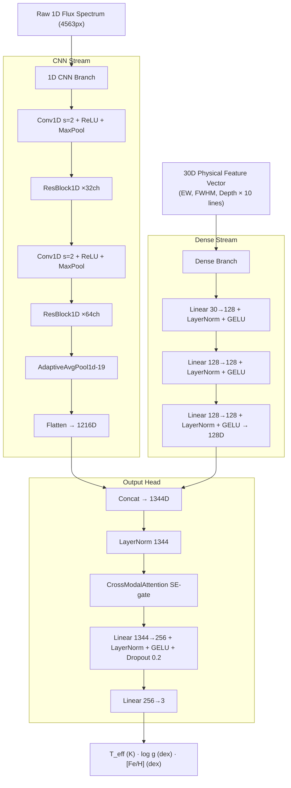

# StellarParameterHybridNet

### Fusing 1D Convolutional Networks with Parametric Physical Line Profiles for Stellar Parameter Estimation

A PyTorch-based machine learning pipeline for estimating fundamental stellar parameters — **Effective Temperature ($T_{\text{eff}}$)**, **Surface Gravity ($\log g$)**, and **Metallicity ($[\text{Fe}/\text{H}]$)** — directly from optical stellar spectra.

The core architecture, `StellarParameterHybridNet`, implements a dual-stream knowledge fusion paradigm: a deep **1D CNN branch** for raw spectral flux feature extraction fused with a **Dense branch** that models **30-dimensional parametric physical line profiles** (Equivalent Width, FWHM, and depth across 10 key absorption lines). Trained on **~71,000 spectra** from SDSS DR17 MaStar (goodspec + combspec), with labels sourced from the **MaStar Stellar Parameter VAC v2** for uniform quality.

An explainable AI (XAI) framework based on cumulative Jacobian gradients and zero-ablation sensitivity analysis verifies physical alignment against established stellar physics.

---

## Dataset Download

All raw FITS files must be placed in `data/raw/` before running the pipeline. Large files are excluded from git (see `.gitignore`).

### Training Data (MaStar DR17)

Download from the [SDSS DR17 Science Archive Server](https://data.sdss.org/sas/dr17/manga/spectro/mastar/v3_1_1/v1_7_7/):

| File | Size | Description | URL |
|------|------|-------------|-----|
| `mastar-goodspec-v3_1_1-v1_7_7.fits.gz` | ~5 GB | Per-visit spectra (59k visits) | [download](https://data.sdss.org/sas/dr17/manga/spectro/mastar/v3_1_1/v1_7_7/mastar-goodspec-v3_1_1-v1_7_7.fits.gz) |
| `mastar-combspec-v3_1_1-v1_7_7-lsfpercent60.0.fits.gz` | ~496 MB | Per-star combined spectra (12k stars) | [download](https://data.sdss.org/sas/dr17/manga/spectro/mastar/v3_1_1/v1_7_7/mastar-combspec-v3_1_1-v1_7_7-lsfpercent60.0.fits.gz) |

### Label Data (MaStar VAC v2)

Download from the [MaStar Stellar Parameter VAC directory](https://data.sdss.org/sas/dr17/manga/spectro/mastar/v3_1_1/v1_7_7/vac/parameters/):

| File | Size | Description | URL |
|------|------|-------------|-----|
| `mastar-goodstars-v3_1_1-v1_7_7-params-v2.fits` | ~7.5 MB | Per-star median Teff/logg/[Fe/H] (4-method median, APOGEE-calibrated) | [download](https://data.sdss.org/sas/dr17/manga/spectro/mastar/v3_1_1/v1_7_7/vac/parameters/mastar-goodstars-v3_1_1-v1_7_7-params-v2.fits) |

### Validation Data (SDSS SEGUE)

The SDSS validation spectra are downloaded automatically by `scripts/download_spec.py` using the included SkyServer CSV catalog. No manual download needed.

> **Tip — moving files to another machine:** Only the 3 raw FITS files above are needed to reproduce everything from scratch. All `.npy` processed files and `.pth` weights are generated by the pipeline and are excluded from git.
>
> ```bash
> rsync -avz --progress data/raw/ user@mac-mini:~/path/to/project/data/raw/
> ```

---

## Repository Structure

```
TermProject/
├── src/
│   ├── data/
│   │   ├── preprocess_flux.py       # Continuum normalization + spike interpolation
│   │   ├── extract_features.py      # 30D physical feature extraction (10 lines)
│   │   ├── extract_labels.py        # VAC v2 label alignment (FEH_NOAPP_MED)
│   │   └── dataset.py               # PyTorch Dataset (split-then-normalize)
│   ├── models/
│   │   ├── hybrid_net.py            # StellarParameterHybridNet (top-level)
│   │   ├── cnn_branch.py            # 1D ResNet CNN → AdaptiveAvgPool1d(19) → 1216D
│   │   ├── dense_branch.py          # MLP: 30D → 128D
│   │   ├── fusion.py                # concat([1216D, 128D]) → 1344D
│   │   └── output_branch.py         # LayerNorm → CrossModalAttention → Linear(3)
│   ├── training/
│   │   └── engine.py                # Training loop (best-checkpoint, resume, LR scheduler)
│   ├── validation/
│   │   ├── eval_core.py             # SDSS spec preprocessing (ivar masking, resolution match)
│   │   ├── eval_core_mastar.py      # MaStar val-fold loader
│   │   ├── error_calculator.py      # SDSS cross-domain evaluation
│   │   ├── error_calculation_mastar.py  # MaStar in-domain evaluation
│   │   └── xai_analyzer.py          # Jacobian XAI + zero-ablation analysis
│   └── utils/
│       ├── config.py                # Hardware detection (CPU/GPU/batch auto-config)
│       └── loss_opt.py              # Loss and optimizer wrappers
├── scripts/
│   ├── train.py                     # python scripts/train.py [--resume]
│   ├── evaluate.py                  # SDSS cross-domain evaluation
│   ├── evaluate_mastar.py           # MaStar in-domain cross-validation
│   ├── xai_analysis.py              # XAI on SDSS spectra
│   ├── xai_analysis_mastar.py       # XAI on MaStar spectra
│   ├── download_spec.py             # SDSS validation FITS downloader
│   ├── gui.py                       # SDSS interactive viewer (Jacobian toggle)
│   ├── gui_mastar.py                # MaStar interactive viewer (Jacobian toggle)
│   ├── compare_domains.py           # Flux domain comparison diagnostic
│   ├── diagnose_stats.py            # Dataset statistics diagnostic
│   └── spec_analyzer.py             # FITS HDU inspector
├── data/
│   ├── raw/                         # Raw FITS files (git-ignored, download separately)
│   ├── processed/                   # Generated .npy matrices (git-ignored)
│   └── validation_dataset/          # SDSS spec FITS + SkyServer CSV
├── weights/                         # Model checkpoints (git-ignored)
├── report/                          # Evaluation reports and XAI summaries
├── scratch/                         # Development notebooks
└── .gitignore
```

---

## Pipeline Execution

### Prerequisites

```bash
pip install torch numpy astropy scipy matplotlib tqdm psutil
```

### Step 1 — Flux Continuum Normalization

Reads goodspec + combspec, applies pixel masking, 201-pixel median-filter continuum normalization, 5σ spike removal via linear interpolation, and deduplicates combspec against goodspec by MANGAID.

```bash
python src/data/preprocess_flux.py
```

- **Input**: `data/raw/mastar-goodspec-v3_1_1-v1_7_7.fits`, `mastar-combspec-*.fits`
- **Output**: `data/processed/X_flux_clean.npy`, `star_ids.npy`, `standard_wave.npy`

### Step 2 — 30D Physical Feature Extraction

Fits Gaussian profiles to 10 absorption lines per spectrum (falling back to non-parametric measurements on fit failure). Parallelized across all available CPU cores with progress tracking.

```bash
python src/data/extract_features.py
```

- **Input**: `data/processed/X_flux_telluric.npy`
- **Output**: `data/processed/X_features_physical.npy`  — shape `(N, 30)`

### Step 3 — Label Alignment

Aligns VAC v2 labels (`TEFF_MED`, `LOGG_MED`, `FEH_NOAPP_MED`) to the flux array order using MANGAID lookup. Uses non-APOGEE-calibrated [Fe/H] to match the SSPP validation scale.

```bash
python src/data/extract_labels.py
```

- **Input**: `data/raw/mastar-goodstars-v3_1_1-v1_7_7-params-v2.fits`, `data/processed/star_ids.npy`
- **Output**: `data/processed/Y_labels.npy`

### Step 4 — Training

Splits by index first (leakage-free), fits normalization stats on train split only, then trains for 80 epochs with best-val-loss checkpointing. Batch size and DataLoader worker count are auto-configured based on detected hardware.

```bash
# Fresh training
python scripts/train.py

# Resume from best checkpoint
python scripts/train.py --resume
```

- **Input**: `data/processed/*.npy`
- **Output**: `weights/stellar_hybrid_model.pth`, `data/processed/label_stats.npy`, `data/processed/feature_stats.npy`

### Step 5 — Validation

```bash
# Cross-domain (SDSS SEGUE spectra — download first if needed)
python scripts/download_spec.py      # populate data/validation_dataset/
python scripts/evaluate.py

# In-domain (MaStar held-out val split)
python scripts/evaluate_mastar.py
```

- **Output**: `report/dataset_error_report.txt`, `report/dataset_error_report_mastar.txt`

### Step 6 — XAI Sensitivity Analysis

Computes cumulative Jacobian gradients $\partial \theta / \partial \lambda$ over 1,000 MaStar spectra. Also runs zero-ablation analysis (30D features zeroed) to quantify the dense branch contribution.

```bash
python scripts/xai_analysis.py         # SDSS spectra
python scripts/xai_analysis_mastar.py  # MaStar spectra
```

- **Output**: `report/xai_physics_report.txt`

### Step 7 — Interactive GUI

Launches a Tkinter dashboard with live Jacobian visualization. The **Toggle** button switches between normal and ablated (30D zeroed) Jacobian in real time. All 10 absorption lines are highlighted in the spectrum and XAI plots.

```bash
python scripts/gui.py           # SDSS viewer
python scripts/gui_mastar.py    # MaStar viewer
```

---

## Model Architecture



### 30D Physical Feature Lines

| Group | Line | Wavelength | Window | Sensitivity |
|-------|------|-----------|--------|-------------|
| Balmer | H-alpha | 6563 Å | ±20 Å | T_eff, log g |
| Balmer | H-beta  | 4861 Å | ±20 Å | T_eff |
| Balmer | H-gamma | 4340 Å | ±20 Å | T_eff |
| Balmer | H-delta | 4102 Å | ±20 Å | T_eff |
| Calcium | Ca II K | 3934 Å | ±15 Å | [Fe/H], T_eff |
| Calcium | Ca II H | 3968 Å | ±15 Å | log g |
| Magnesium | Mg I b | 5175 Å | ±20 Å | **log g** (XAI #1) |
| Iron | Fe I 5270 | 5270 Å | ±15 Å | [Fe/H] |
| Iron | Fe I 4383 | 4383 Å | ±15 Å | [Fe/H] |
| Sodium | Na I D | 5892 Å | ±15 Å | log g, [Fe/H] |

Each line contributes 3 values: **EW** (equivalent width), **FWHM**, and **depth** → 10 × 3 = **30D**.

### CrossModalAttention

A Squeeze-Excite self-gating mechanism applied to the fused 1344D vector:

$$\text{Attention}(X) = X \odot \sigma\!\left(\text{Linear}\!\left(\text{GELU}\!\left(\text{Linear}(X)\right)\right)\right)$$

---

## Hardware Auto-Configuration

`src/utils/config.py` detects hardware at startup and sets optimal parameters automatically:

| Setting | M2 Pro (12C / 32GB) | M4 (10C / 16GB) |
|---------|---------------------|-----------------|
| `CPU_WORKERS_PREPROCESS` | 11 | 9 |
| `CPU_WORKERS_DATALOADER` | 6 | 5 |
| `BATCH_SIZE` | 256 (auto) | 128 (auto) |

Requires `psutil` for memory detection (`pip install psutil`). Falls back to 128 if unavailable.

---

## Key Engineering Decisions

### Label↔Flux Alignment
`extract_labels.py` iterates in flux order (`star_ids.npy`) and looks up VAC labels by MANGAID, guaranteeing that row $i$ of `X_flux` corresponds to row $i$ of `Y_labels`. An earlier bug iterating in catalog order caused label scrambling across all training samples.

### Split-Then-Normalize
`engine.py` computes normalization statistics exclusively on the train split before constructing the val dataset. The resulting `label_stats.npy` and `feature_stats.npy` are loaded by all evaluation scripts, ensuring denormalization uses the exact training-time constants rather than hardcoded values.

### Edge Spike Correction
Raw MaStar spectra suffer from edge-pixel spikes caused by median-filter boundary effects. After continuum division, any pixel deviating more than 5σ from the median is replaced by linear interpolation from valid neighbors. Without this fix, ~15% of training spectra collapsed to a flat line of −0.33 after z-score normalization, making absorption lines invisible to the CNN.

### Domain Alignment (SDSS Validation)
SDSS BOSS spectra (R~2000) have slightly higher resolution than MaStar (R~1800). `eval_core.py` applies a Gaussian blur of σ=0.35px after wavelength resampling to match MaStar's instrumental profile, and uses `ivar ≤ 0` as the bad-pixel mask (equivalent to MaStar's `MASK != 0`).

### Label Source
Training uses `FEH_NOAPP_MED` (non-APOGEE-calibrated [Fe/H] median) from VAC v2. The APOGEE-calibrated column (`FEH_MED`) introduces a systematic offset against the SSPP optical scale used in the SDSS validation set, which degraded cross-domain [Fe/H] R² from −0.29 to −1.21 in earlier experiments.

### Combspec Deduplication
`preprocess_flux.py` builds a MANGAID set from goodspec before appending combspec. Any combspec star already present in goodspec (as a per-visit entry) is skipped to prevent the same star appearing in both train and val splits.

---

## XAI Hypotheses

### Hypothesis 1 — Global Weight Attribution
The 30D dense branch must claim a measurable fraction of the first post-fusion layer's L1 weight magnitude, confirming active information fusion rather than the model ignoring physical features.

### Hypothesis 2 — Local Jacobian Sensitivity
The Jacobian $\partial \log g / \partial \lambda$ should peak at physically meaningful absorption-line wavelengths rather than at uninformative continuum regions. The proof ratio is defined as:

$$\text{Proof Ratio} = \frac{\text{mean Jacobian in H-alpha region}}{\text{mean Jacobian in continuum}}$$

### Zero-Ablation Analysis
Setting the 30D feature vector to zero measures the dense branch's absolute contribution in physical units (K, dex). The GUI toggle button exposes this comparison interactively.

---

## Report Files

| File | Contents |
|------|----------|
| `report/dataset_error_report.txt` | MAE / RMSE / R² on SDSS validation set |
| `report/dataset_error_report_mastar.txt` | MAE / RMSE / R² on MaStar held-out val |
| `report/xai_physics_report.txt` | Jacobian sensitivity, proof ratios, ablation shifts |
| `report/xai_physics_report_mastar.txt` | Same metrics computed on MaStar spectra |
